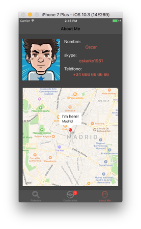

# Prueba técnica (iOS - Swift 3.0) para Batura Mobile #

Proyecto a modo de prueba de conocimientos para la empresa **Batura Mobile Solutions** sobre la tecnología Swift 3.0. 

Mayo de 2017. La empresa [Batura Mobile](http://baturamobile.com/) puso un tuit donde buscaban desarrollador iOS. Tras contacarles, me encomendaron esta pequeña aplicación/pokédex sobre pokemons. Me encanta "jugar" con estas pruebas - *como siempre* - dando rienda suelta a mi creatividad. 
El proyecto está desarrollado en `Xcode 8`, y es una simple aplicación a modo de pokédex. Llama a un WebService para coger datos de los pokemons y los guarda en Core Data. En el `About Me` he añadido un pequeño mapa. Simple y divertido.

Para más información, visita mi blog: [www.oscargarrucho.com](http://www.oscargarrucho.com/)
